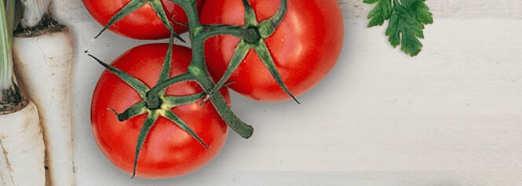

# AV Recipe Book Angular9 Project

## Description
Have learned VueJS and ReactJS now it is time to finally try Angular and see how it differs from other frameworks. This is a Udemy Angular course project still in progress but already added Netlify pipeline.

To learn more than the course gives me, I chose to go with different tools - Stylus & PUG compared to what instructor chose (regular HTML and CSS files).

#### [Demo](https://av-recipe-book.netlify.app/)

## Features
- create shopping list
- create recipes & ingredients
- save & retrieve your own recipes

## Technologies Used
- Angular-CLI 9.1.1
- with Typescript, PUG & Stylus

## Clone & Run Locally
Run `ng serve` for a dev server -> `http://localhost:4200/`

## How to contribute?
Contact me through mail `vilde.andris@gmail.com` with suggestions.
