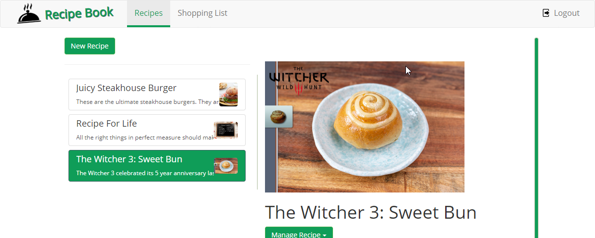

# AV Recipe Book Project
Have learned VueJS and ReactJS now it is time to finally try latest Angular and see how it differs from other frameworks. Created this project from scratch as I could not just copy-paste the instructors code due to using different HTML and CSS frameworks.

Application is a simple recipe book where you can save/edite/delte your own recipes with authorization. You can also add recipe ingredients to shopping list and print it.

## What I did differently
This is a Udemy Angular course project which I decided to improve in many ways to learn more than the course gives me:
* used `PUG` framework instead of regular HTML
* used `Stylus` CSS pre-processor instead of regular CSS
* added color theme
* responsivness on different devices
* storing changes automatically
* test user with test data with one button click
* animations
* unit of measure for ingredients

#### [Demo](https://av-recipe-book.netlify.app/)

## Technologies Used
- Angular-CLI 9.1.1
- with Typescript, PUG & Stylus

## Clone & Run Locally
Run `ng serve` for a dev server -> `http://localhost:4200/`

## How to contribute?
Contact me through mail `vilde.andris@gmail.com` with suggestions.
